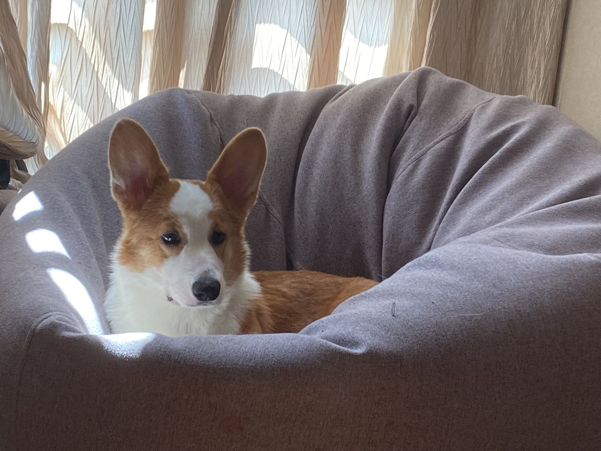

## Haonan Jiang's User Page
# Quick guide
[About Me](#About-Me)  
[As a progammer](#As-a-programmer)  
[Goals](#Goals)  
# About Me
I am currently a third-year **Computer Science** major in **Warren** college. I enjoy traveling but have no occasion in a while because of the pandemic. I like watching movies, reading novels, playing video games, and working out in my spare time. I have a corgi back in China who is taken care of by my parents now.

# As a programmer
My favorite language is Java. The code that I most often use is 
```
println();
```
Other languages that I am familiar with:
- C++
- Python
- C
- R
- MATLAB
# Goals
Things I want to accomplish during academic year 2021-2022:
- [ ] Learn the skills as a software engineer.
- [ ] Determine the area I want to work on.
- [ ] Find a full-time intern at summer.
